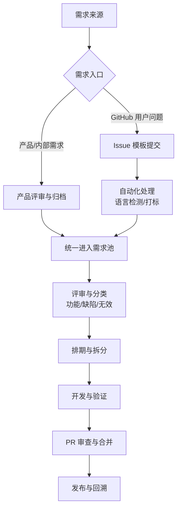

# Home Assistant Core 开源项目管理流程

本文档详细说明 Home Assistant Core 开源项目的管理流程和贡献指南。

## 目录

1. [需求来源与入口](#需求来源与入口)
2. [需求处理与落地流程](#需求处理与落地流程)
3. [贡献流程](#贡献流程)
4. [代码提交流程](#代码提交流程)
5. [问题管理](#问题管理)
6. [代码审查流程](#代码审查流程)
7. [行为准则](#行为准则)
8. [贡献者许可协议](#贡献者许可协议)
9. [自动化工作流](#自动化工作流)

---

## 需求来源与入口

本项目需求主要来自两个渠道，并按不同入口进入管理流程：

1. **产品/内部需求**：由产品提出并进入内部需求池（或 Roadmap）
2. **GitHub 用户问题**：由用户在 GitHub Issues 中提交

### 入口规范

- 产品需求应先完成内部评审，明确目标、范围、版本节奏与验收标准
- GitHub 问题必须使用 Issue 模板，确保环境、配置、日志完整
- 所有需求统一进入“需求池/看板”，并绑定唯一 ID 以便追踪

---

## 需求处理与落地流程

### 1. 收集与归档

- 产品需求：由产品负责人归档，添加优先级与目标版本
- GitHub Issues：自动标签、语言检测；去重为可选能力（需单独配置）

### 流程图

### 2. 评审与分类

- **功能需求**：新能力或重要优化 → 进入规划
- **缺陷问题**：影响现有用户 → 进入修复流程
- **重复/不完整**：打标并引导补充或关闭

### 3. 排期与拆分

- 需求评审后进入迭代排期
- 大需求拆分为可交付子任务（Issue / PR）
- 明确验收标准与风险点

### 4. 开发与验证

- 开发实施 → 自测 → 自动化测试
- 必要时补充文档与配置说明

### 5. 评审与合并

- PR 走标准审查流程
- 满足测试与质量要求后合并

### 6. 发布与回溯

- 发布说明中记录需求来源与变更点
- 重要问题回溯原因并更新流程

---

## 贡献流程

### 1. 准备工作

- **阅读文档**：参考 [Kubernetes 的 PR 审查最佳实践](https://github.com/kubernetes/community/blob/master/contributors/guide/pull-requests.md#best-practices-for-faster-reviews)（跳过步骤 0 和 1）
- **Fork 仓库**：Fork [Home Assistant Core 仓库](https://github.com/home-assistant/core)
- **查看开发者文档**：访问 [开发者文档](https://developers.home-assistant.io/) 获取详细信息

### 2. 开发步骤

1. **编写代码**：为你的设备、通知服务、传感器或 IoT 设备编写代码
2. **确保测试通过**：运行测试并确保所有测试都通过
3. **创建 Pull Request**：向 Home Assistant 的 **dev** 分支提交 Pull Request

### 3. 功能建议

- **功能请求**：在 [社区论坛的功能请求板块](https://community.home-assistant.io/c/feature-requests) 发帖
- **问题追踪**：使用 [GitHub Issues](https://github.com/home-assistant/core/issues) 追踪 bug，不用于功能请求

---

## 代码提交流程

### Pull Request 检查清单

提交 PR 前，请确保：

- [ ] 代码已测试并在本地运行正常
- [ ] 本地测试通过（**测试不通过无法合并**）
- [ ] PR 中没有注释掉的代码
- [ ] 遵循了 [开发检查清单][dev-checklist]
- [ ] 遵循了 [完美 PR 建议][perfect-pr]
- [ ] 代码已使用 Ruff 格式化（`ruff format homeassistant tests`）
- [ ] 已添加测试以验证新代码工作正常

### 如果添加/更改了用户可见功能或配置变量：

- [ ] 已在 [www.home-assistant.io][docs-repository] 添加/更新文档

### 如果代码与设备、Web 服务或第三方工具通信：

- [ ] [清单文件][manifest-docs] 已正确填写所有字段
  - 运行：`python3 -m script.hassfest` 更新并包含派生文件
- [ ] 新的或更新的依赖已添加到 `requirements_all.txt`
  - 运行：`python3 -m script.gen_requirements_all` 更新
- [ ] 对于更新的依赖 - 在 PR 描述中添加变更日志链接，或至少添加库版本之间的差异

### 帮助审查其他 PR

为了帮助处理大量传入的 PR：

- [ ] 我已审查了此仓库中的另外两个 [开放的 Pull Request][prs]

### PR 类型

- [ ] 依赖升级
- [ ] Bug 修复（非破坏性更改，修复问题）
- [ ] 新集成（感谢！）
- [ ] 新功能（为现有集成添加功能）
- [ ] 弃用（未来将发生的破坏性更改）
- [ ] 破坏性更改（导致现有功能中断的修复/功能）
- [ ] 代码质量改进或添加测试

---

## 问题管理

### 问题报告模板

报告问题时需要提供：

1. **问题描述**：清楚描述遇到的问题
2. **环境信息**：
   - Home Assistant Core 版本
   - 最后正常工作的版本（如果已知）
   - 运行环境（OS/Container/Supervised/Core）
   - 导致问题的集成
   - 集成文档链接
3. **配置示例**：相关的 `configuration.yaml` 配置
4. **错误日志**：相关的 traceback 或错误日志

### 问题处理流程

- 使用 GitHub Issues 追踪 bug
- 功能请求应在社区论坛讨论
- 问题会被自动检测重复和非英语内容

---

## 代码审查流程

### 审查标准

1. **代码质量**：代码符合项目标准
2. **测试覆盖**：新代码有适当的测试
3. **文档完整性**：相关文档已更新
4. **向后兼容性**：不破坏现有功能（除非是破坏性更改）

### 审查等待时间

- 项目非常活跃，PR 数量很多
- 审查等待时间可能较长
- 可以通过审查其他 PR 来帮助加快整体审查速度

---

## 行为准则

### 我们的承诺

我们承诺为所有参与者提供无骚扰的体验，无论年龄、体型、残疾、种族、性别认同和表达、经验水平、教育、社会经济地位、国籍、个人外貌、种族、宗教或性取向。

### 我们的标准

**积极行为包括：**
- 对他人表现出同理心和善意
- 尊重不同的意见、观点和经验
- 给予并优雅地接受建设性反馈
- 承担责任并道歉

**不可接受的行为包括：**
- 使用性化语言或图像
- 恶意评论、人身攻击
- 公开或私下骚扰
- 未经许可发布他人私人信息

### 违规处理

违规行为可通过以下方式报告：
- 发送邮件至：safety@home-assistant.io
- 使用平台的举报/标记功能

处理措施包括：纠正、警告、临时封禁、永久封禁

---

## 贡献者许可协议

### CLA 要求

提交 PR 时，您需要签署贡献者许可协议（CLA），证明：

1. 贡献完全或部分由您创建，您有权在 Apache 2.0 许可下提交
2. 或者，贡献基于之前的工作，该工作受适当的开源许可覆盖
3. 或者，贡献由其他人直接提供给您，且您未修改
4. 您理解并同意项目和贡献是公开的，贡献记录将永久保存

### 签署方式

首次提交 PR 到 Home Assistant 组织下的仓库时，系统会自动提示您签署 CLA。

---

## 自动化工作流

项目使用 GitHub Actions 自动化多个流程：

### 主要工作流

1. **CI 工作流** (`ci.yaml`)：自动化测试和代码检查
2. **代码质量** (`codeql.yml`)：代码安全分析
3. **构建** (`builder.yml`)：构建项目
4. **依赖管理** (`dependabot.yml`)：自动更新依赖
5. **翻译** (`translations.yml`)：处理翻译更新
6. **问题管理**：
   - `detect-duplicate-issues.yml`：检测重复问题
   - `detect-non-english-issues.yml`：检测非英语问题
   - `stale.yml`：标记过时的问题和 PR

### 自动化检查

- 代码格式检查（Ruff）
- 类型检查（mypy）
- 测试运行
- 代码覆盖率
- 安全检查

---

## 有用的链接

- **开发者文档**：https://developers.home-assistant.io/
- **开发检查清单**：https://developers.home-assistant.io/docs/development_checklist/
- **完美 PR 建议**：https://developers.home-assistant.io/docs/review-process/#creating-the-perfect-pr
- **清单文档**：https://developers.home-assistant.io/docs/creating_integration_manifest/
- **质量等级**：https://developers.home-assistant.io/docs/integration_quality_scale_index/
- **文档仓库**：https://github.com/home-assistant/home-assistant.io
- **社区论坛**：https://community.home-assistant.io/
- **GitHub 仓库**：https://github.com/home-assistant/core

---

## 总结

本项目以“产品需求 + GitHub 用户问题”为双入口，统一进入需求池并完成：

1. **收集归档 → 评审分类 → 排期拆分**
2. **开发验证 → 审查合并 → 发布回溯**
3. **自动化工具与社区协作持续优化**

这套流程确保需求可追踪、交付可验证、质量可持续。

---

*最后更新：基于 Home Assistant Core 项目当前文档整理*

